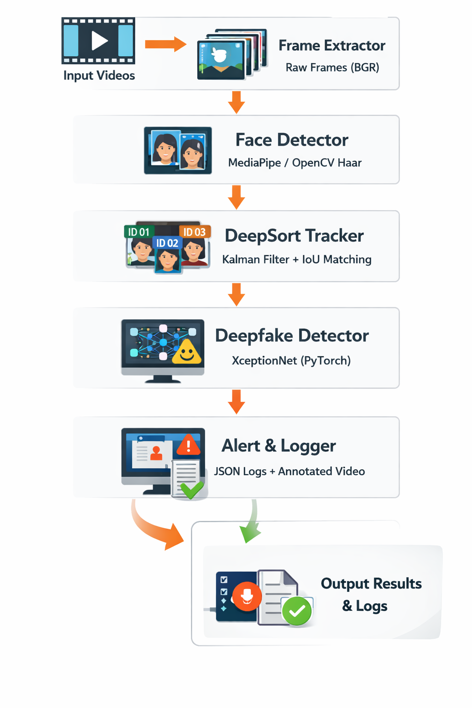

# Detonix ZoomGuard
### Real-Time Deepfake Detection System (Pre-recorded Video Mode)
**Quaid-i-Azam University | CS Final Year Project**
**Supervised by: Dr. Syed M Naqi | Developed by: Hussain Ali**

---

## Overview

Detonix ZoomGuard detects deepfake faces in video files using:
- **MediaPipe** — fast multi-face detection
- **DeepSort** — identity tracking across frames (custom implementation)
- **XceptionNet / MobileNetV2** — deepfake classification via PyTorch
- **OpenCV** — video I/O and annotation

It processes every face independently across frames, assigns persistent IDs, and labels each person as **REAL** or **DEEPFAKE** with a confidence score.

---

## System Architecture


---

## Quick Start

### Step 1 — Install Python
Make sure you have **Python 3.8 or higher** installed.

```bash
python --version   # Should be 3.8+
```

### Step 2 — Create Virtual Environment (Recommended)

```bash
# Windows
python -m venv venv
venv\Scripts\activate

# Linux / macOS
python3 -m venv venv
source venv/bin/activate
```

### Step 3 — Install Dependencies

```bash
pip install -r requirements.txt
```

If MediaPipe fails on your system:
```bash
pip install mediapipe --extra-index-url https://pypi.ngc.nvidia.com
# OR skip it — system falls back to OpenCV Haar Cascades automatically
```

### Step 4 — Verify Installation

```bash
python test_install.py
```
All checks should show ✓. If something fails, re-run `pip install -r requirements.txt`.

### Step 5 — Add Your Videos

Drop your video files into the `input_videos/` folder:

```
input_videos/
├── meeting_recording.mp4
├── interview.mov
└── suspect_video.avi
```

**Supported formats:** `.mp4`, `.avi`, `.mov`, `.mkv`, `.wmv`, `.flv`, `.webm`, `.m4v`

### Step 6 — Run ZoomGuard

```bash
python main.py
```

That's it! Annotated videos appear in `output_results/` and logs in `logs/`.

---

## Getting a Trained Deepfake Detection Model

> **Important:** Without a fine-tuned model, the system runs correctly (face detection, tracking, annotation) but deepfake classification scores will not be reliable. You need a model trained on deepfake datasets.

### Option A — FaceForensics++ XceptionNet (Recommended)

1. Visit: https://github.com/ondyari/FaceForensics
2. Fill the request form to access pretrained models
3. Download `xception-raw.p` or `xception_c23.p`
4. Run with: `python main.py --model models/xception_c23.pth`

### Option B — Open Source Alternatives

| Model | Source | Notes |
|-------|--------|-------|
| EfficientNet-B4 | https://github.com/beibuwandeluori/DFDC | DFDC competition model |
| XceptionNet | https://github.com/HongguLiu/Deepfake-Detection | FaceForensics trained |
| Multi-task model | https://github.com/wenbinFei/FakeFaceDetection | Multi-dataset |

### Option C — Train Your Own

Datasets for training:
- **FaceForensics++**: https://github.com/ondyari/FaceForensics
- **Celeb-DF**: https://github.com/yuezunli/celeb-deepfakeforensics
- **DFDC**: https://ai.facebook.com/datasets/dfdc/

Place trained model weights in `models/` folder.

---

## Usage Options

### Process all videos in folder
```bash
python main.py
```

### Process a single video
```bash
python main.py --video input_videos/my_video.mp4
```

### Use a custom model
```bash
python main.py --model models/xception_c23.pth
```

### Headless mode (no preview window — for servers)
```bash
python main.py --no-display
```

### Adjust detection threshold
```bash
python main.py --threshold 0.6   # More conservative (fewer false positives)
python main.py --threshold 0.4   # More sensitive (catches more deepfakes)
```

### Process faster (skip more frames)
```bash
python main.py --skip 5   # Analyze every 5th frame (faster but less accurate)
python main.py --skip 1   # Analyze every frame (most accurate, slowest)
```

### Full options
```
python main.py --help

Options:
  --input     Input folder path (default: input_videos/)
  --video     Single video path
  --output    Output folder (default: output_results/)
  --model     Custom model .pth file
  --threshold Deepfake threshold 0–1 (default: 0.5)
  --skip      Process every N frames (default: 3)
  --no-display Headless mode, no preview
  --face-conf  Face detection confidence (default: 0.5)
  --max-age   Max frames before track removed (default: 30)
```

---

## Output

### Annotated Video
Saved in `output_results/` with bounding boxes:
- 🟢 **Green box** — Person detected as REAL
- 🔴 **Red box** — Person detected as DEEPFAKE
- 🟡 **Yellow box** — Analyzing (not enough frames yet)

Each box shows:
- Person ID (persistent across frames)
- Verdict + confidence score
- Score bar at bottom of box

### Log Files
Saved in `logs/`:
- `zoomguard_YYYYMMDD_HHMMSS.log` — Full application log
- `session_YYYYMMDD_HHMMSS.json` — Detection results in JSON

### Console Summary
After each video:
```
============================================================
  DETONIX ZOOMGUARD — SESSION SUMMARY
============================================================
  Session ID  : 20260410_143022
  Total Alerts: 2
  Duration    : 47s
------------------------------------------------------------
  Person       Verdict        Confidence   Frames
------------------------------------------------------------
  ID-1         ✓ REAL         91.2%        156
  ID-2         ⚠ DEEPFAKE     78.4%        143
  ID-3         ✓ REAL         88.0%        89
============================================================
```

---

## Project Structure

```
zoomguard/
├── main.py                  ← Entry point
├── orchestrator.py          ← Core pipeline coordinator
├── requirements.txt
├── test_install.py          ← Installation verifier
├── download_model.py        ← Model setup guide
│
├── utils/
│   ├── deep_sort.py         ← DeepSort tracker (Kalman + IoU)
│   ├── face_detector.py     ← MediaPipe / Haar face detection
│   ├── deepfake_model.py    ← XceptionNet / MobileNetV2 model
│   └── logger.py            ← Session logging
│
├── models/                  ← Place .pth model files here
├── input_videos/            ← Drop your videos here
├── output_results/          ← Annotated output saved here
└── logs/                    ← Detection logs saved here
```

---

## Troubleshooting

**"No module named mediapipe"**
```bash
pip install mediapipe
# System will use OpenCV fallback if this fails
```

**"CUDA out of memory"**
```bash
python main.py --skip 5   # Process fewer frames
# System auto-falls back to CPU
```

**"No videos found"**
- Check that `input_videos/` folder exists and has supported video files
- Supported: `.mp4`, `.avi`, `.mov`, `.mkv`, `.wmv`, `.flv`, `.webm`, `.m4v`

**Slow processing**
```bash
python main.py --skip 5 --no-display   # Skip more frames + disable preview
```

**Low accuracy (expected without trained model)**
- Download a FaceForensics++ trained XceptionNet model
- See "Getting a Trained Model" section above

---

## Academic Note

This system adapts the original ZoomGuard architecture (designed for Zoom RTMS) to work with pre-recorded video files. The core deepfake detection pipeline, DeepSort tracking, and alert logic are identical to the live meeting version. The only difference is the video source: instead of Zoom RTMS, frames are read from `.mp4` / `.avi` files on disk.

---

*Detonix ZoomGuard | Session 2022–2026 | QAU Computer Science*
